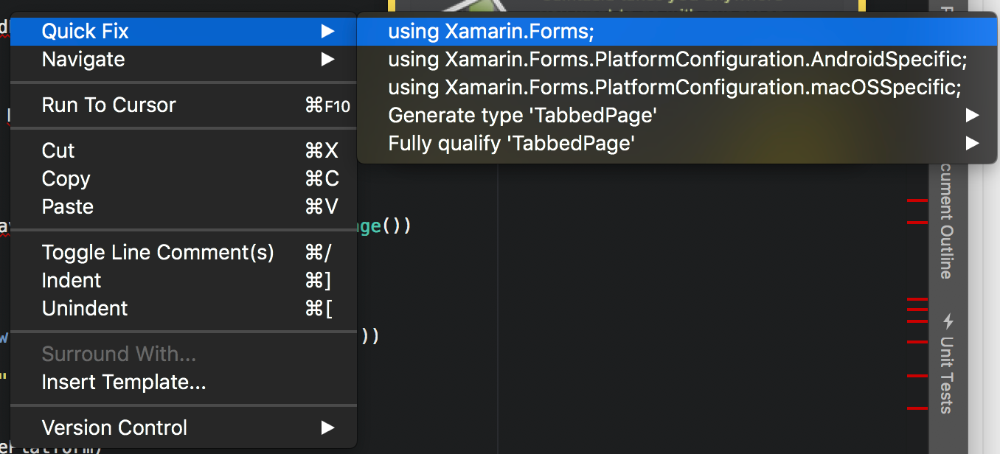
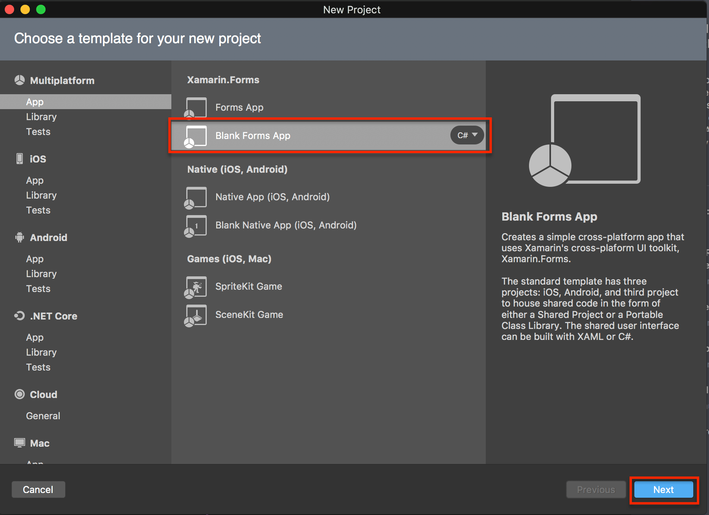
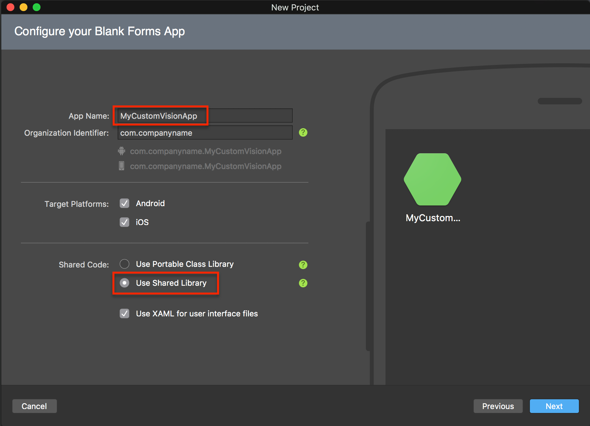
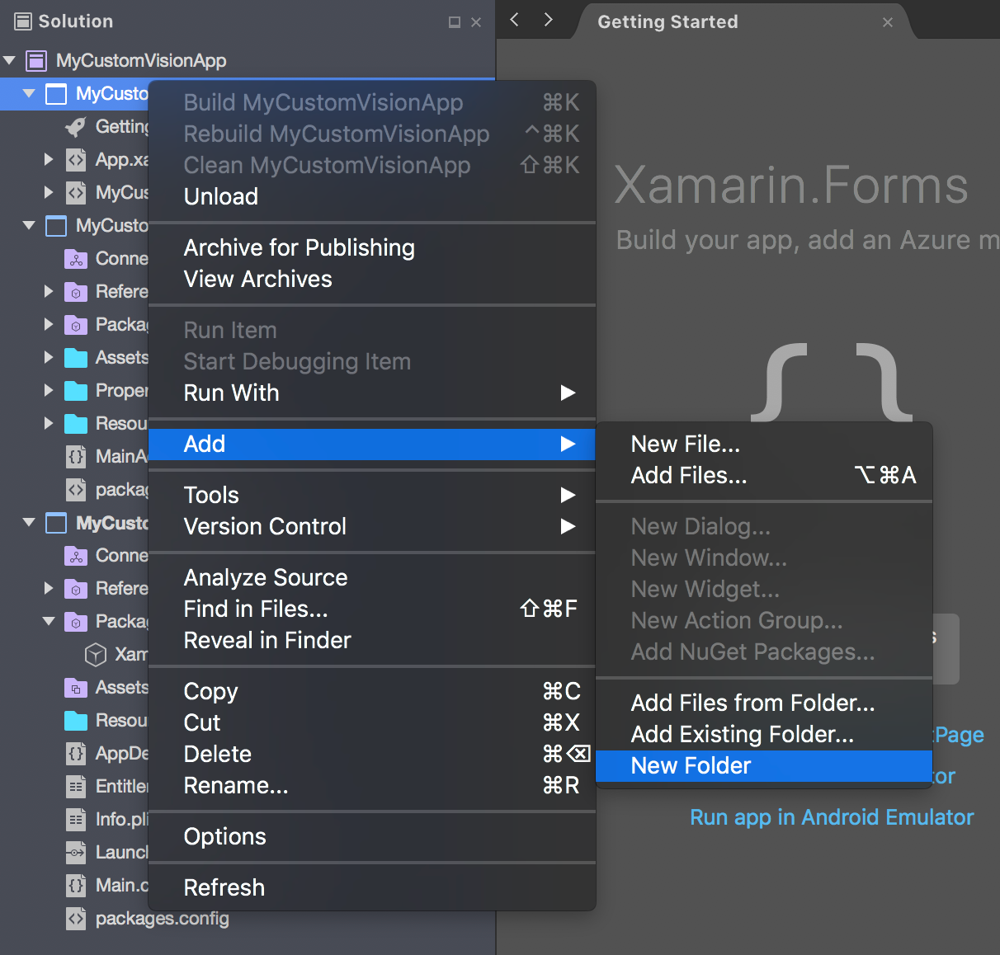
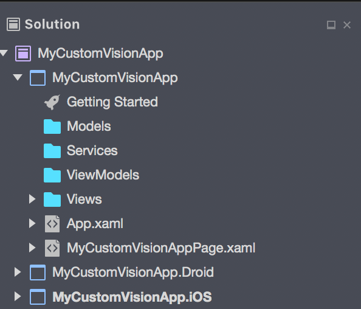
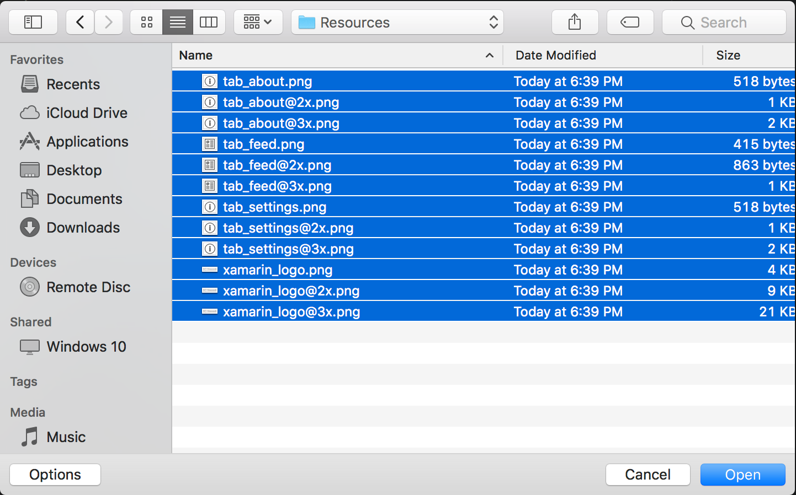
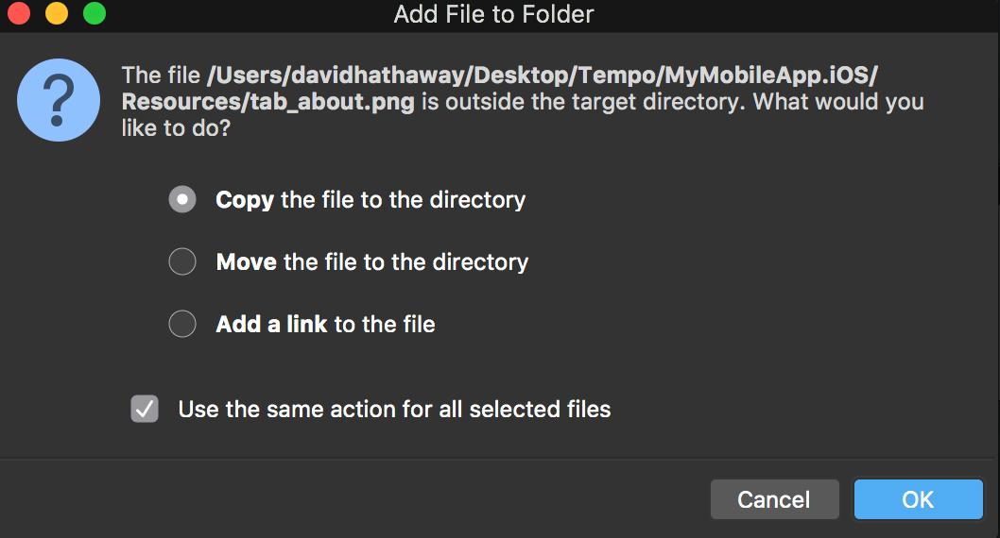

# Mobile App Hack

Now that we've gone through setting up the backend, we will walk through building out the mobile app to consume the Custom Vision APIs.

Throughout this hack, we'll be adding in new class files by copying/pasting codes snippets.  There mayu be some cases where it's not explicitly stated that you need to add `using` statements.  Make sure to right click on unresolved classes, and choose "Quick Fix" for suggestions to resolve missing references.



Before we start, we are going to clone the entire repo locally.  There are some files that we'll use later in the app that we'll want to have handy.

`git clone https://github.com/rob-derosa/CustomVisionHack.git`

## Step 1: Create a new mobile app

1. In Visual Studio, create a new project.  Choose "Blank Xamarin Forms App"



2. Enter in a Name for your app, and choose "Shared Project" for the "Shared Code" selection



3. Click Next, choose a folder for your project, and click create

4. In yoru Solution Tree, find your iOS app, and expand the code tree.  Expand the `Packages` folder, right click on "Xamarin.Forms", and choose "Update" to update to the latest version of Xamarin.Forms.

5. Repeat Step 4 for the Android project.

```Note: In your android app, there will be a number of other Nuget packages.  For the purposes of this hack, it's not necessary to update them all.  Just let Nuget update the ones required for the Xamarin.Forms update.```

6. In both your iOS and Android apps, add the following additional Nuget packages

- Newtonsoft.Json
- Plugin.Permissions
- Xam.Plugin.Connectivity
- Xam.Plugin.Media

You've now got your project created, you can move on to the next step, and scaffold out the project structure

## Step 2: Scaffold your project

Under your app, you now have 3 projects.  The first is your Shared Project, where all of your common code lives.  We'll do most of our coding in this project.

Next, you'll see the Xamarin.Android app, followed by the Xamarin.iOS app.  We'll periodically touch these projects, but will mostly live in the Shared Project.

1. Right click on your Shared Project, and click Add > New Folder, and call it `Models`



2. Repeat step 1, creating new folders called `Services`, `ViewModels`, and `Views`.  When you've completed this step, your project should look like this:



I mentioned earlier in the hack that we'd be making a few changes directly to the iOS and Android projects.  iOS and Android each have their own ways of doing certain tasks.  An example of that is how different resolutions of images are treated.  iOS and Android have unique ways of loading up images.  Throughout the app, there are references to image files that need to be directly included in the iOS app's `Resources` folder, or the Android app's `Resources/drawable*` folders.

3. Expand the iOS app in your solution, and locate the `Resources` folder.  Right click on `Resources`, and choose `Add` > `Add Files`.  In the dialog browse to the root of the repo that you cloned earlier in this guide.  Browse to the `/src/completed/MyMobileApp.iOS/Resources` folder, and choose all of the image files, and click `Open`



4. In the dialog, choose "Copy the file to the directory" option, and click "OK". This will add those image files to your iOS app.



## Step 3: Start building the app.

1. Open up the `App.xamls.cs` file, and add a property to your app class

`public static string AzureFunctionsUrl;`

2. Right click on your `Views` folder, and choose Add > New File.  In the dialog, choose General > Empty Class, and call the file MainPage.  Add `using Xamarin.Forms;` to your using statements, and replace the implemantation of the class MainPage with the following:

```
	public class MainPage : TabbedPage
	{
		public MainPage()
		{
			var predictPage = new NavigationPage(new PredictionDetailsPage())
			{
				Title = "Predict"
			};

			var itemsPage = new NavigationPage(new PredictionListPage())
			{
				Title = "History"
			};

			var settingsPage = new NavigationPage(new SettingsPage())
			{
				Title = "Settings"
			};

			switch(Device.RuntimePlatform)
			{
				case Device.iOS:
					itemsPage.Icon = "tab_feed.png";
					predictPage.Icon = "tab_about.png";
					settingsPage.Icon = "tab_settings.png";
					break;
			}

			Children.Add(predictPage);
			Children.Add(itemsPage);
			Children.Add(settingsPage);

			Title = Children[0].Title;
		}

		protected override void OnCurrentPageChanged()
		{
			base.OnCurrentPageChanged();
			Title = CurrentPage?.Title ?? string.Empty;
		}
	}
```

3. Right click on your `Views` folder, and choose Add > New File.  In the dialog, choose `Forms` > `Forms ContentPage Xaml`, and call the file `PredictionDetailsPage`.

Repeat this step to create two more pages called `PredictionListPage` and `SettingsPage`

We'll come back to these pages in a little bit to add some layout, and functionality.  First, we're going to add the rest of our classes.

4. In your `Models` folder, we're going to add some new classes.  Please add the following class files, with the corresponding class implementations

- BaseModel.cs

```
    public class BaseModel
    {
        public BaseModel()
        {
            Id = Guid.NewGuid().ToString();
        }

        [JsonProperty("id")]
        public string Id { get; set; }
    }
```

- Prediction.cs

```
    public class Prediction : BaseModel
    {
        public string ProjectId { get; set; }
        public string TrainingKey { get; set; }
        public string ImageUrl { get; set; }
        public string UserId { get; set; }
        public DateTime? TimeStamp { get; set; }
        public Dictionary<string, decimal> Results { get; set; }

        [JsonIgnore]
        public string Description
        {
            get
            {
				if(Results == null)
					return null;
				
                var sb = new StringBuilder();

                foreach (var tag in Results)
					sb.Append($"{tag.Key}: {tag.Value.ToString("0.00%")}, ");

                if (sb.Length == 0)
                    sb.Append("no matching tags");

                return sb.ToString().Trim().TrimEnd(',');
            }
        }
    }
```

5. As in the previous step, we're going to add some files that will hold our implementationof web service clients.  Please create the following files under the `Services` folder.

- IDataStore

```
	public interface IDataStore
	{
		Task<IEnumerable<Prediction>> GetPredictionsAsync(bool forceRefresh = false);
		Task<Prediction> MakePredictionAsync(byte[] image);
		void Reset();
	}

	public static class DataStore
	{
		static IDataStore _instance;
		public static IDataStore Instance => _instance ?? (_instance = DependencyService.Get<IDataStore>());
	}
```

- CloudDataStore.cs

```
	public class CloudDataStore : IDataStore
	{
		HttpClient _client;
		IEnumerable<Prediction> _predictions;

		public CloudDataStore()
		{
			Reset();
			_predictions = new List<Prediction>();
		}

		public void Reset()
		{
			_client = new HttpClient();
			_client.BaseAddress = new Uri($"{App.AzureFunctionsUrl.TrimEnd('/')}/");
		}

		public async Task<IEnumerable<Prediction>> GetPredictionsAsync(bool forceRefresh = false)
		{
			if(forceRefresh && CrossConnectivity.Current.IsConnected)
			{
				var json = await _client.GetStringAsync($"databaseId/collectionId");
				_predictions = await Task.Run(() => JsonConvert.DeserializeObject<IEnumerable<Prediction>>(json));
			}

			return _predictions;
		}

		public async Task<Prediction> MakePredictionAsync(byte[] image)
		{
			if(image == null || !CrossConnectivity.Current.IsConnected)
				return null;

			HttpResponseMessage response = null;
			try
			{
				var imageContent = new ByteArrayContent(image);
				response = await _client.PostAsync("api/MakePrediction", imageContent);
				var result = JsonConvert.DeserializeObject<Prediction>(response.Content.ReadAsStringAsync().Result);
				return result;
			}
			catch(Exception e)
			{
				var error = response.Content.ReadAsStringAsync().Result;

				if(error == null)
					error = e.Message;

				Console.WriteLine($"Error making prediction: {error}");
				return null;
			}
		}
	}
```

6. Finally, please add the following files to the `ViewModels` folder

- BaseViewModel.cs

```
	public class BaseViewModel : INotifyPropertyChanged
	{
		bool isBusy = false;
		public bool IsBusy
		{
			get { return isBusy; }
			set { SetProperty(ref isBusy, value); }
		}

		string title = string.Empty;
		public string Title
		{
			get { return title; }
			set { SetProperty(ref title, value); }
		}

		protected bool SetProperty<T>(ref T backingStore, T value,
			[CallerMemberName]string propertyName = "",
			Action onChanged = null)
		{
			if(EqualityComparer<T>.Default.Equals(backingStore, value))
				return false;

			backingStore = value;
			onChanged?.Invoke();
			OnPropertyChanged(propertyName);
			return true;
		}

		#region INotifyPropertyChanged
		public event PropertyChangedEventHandler PropertyChanged;
		protected void OnPropertyChanged([CallerMemberName] string propertyName = "")
		{
			var changed = PropertyChanged;
			if(changed == null)
				return;

			changed.Invoke(this, new PropertyChangedEventArgs(propertyName));
		}
		#endregion
	}
```

- PredictionDetailsViewModel.cs

```
	public class PredictionDetailsViewModel : BaseViewModel
	{
		public ICommand ResetDataCommand => new Command(ResetData);
		public ICommand TakePictureCommand => new Command(TakePicture);
		public ICommand MakePredictionCommand => new Command(MakePrediction);

		string _status = "Snap a pic of a shoe to get started";
		public string Status
		{
			get { return _status; }
			set { SetProperty(ref _status, value); }
		}

		byte[] _imageBytes;
		ImageSource _imageSource;
		public ImageSource ImageSource
		{
			get { return _imageSource; }
			set { SetProperty(ref _imageSource, value); OnPropertyChanged(nameof(HasImageSource)); }
		}

		public bool HasImageSource => ImageSource != null;

		public PredictionDetailsViewModel()
		{
			Title = "Make Prediction";
		}

		void ResetData()
		{
			ImageSource = null;
			Status = null;
		}

		#region Take/Choose Picture

		async void TakePicture()
		{
			MediaFile file;

			if (!CrossMedia.Current.IsCameraAvailable)
			{
				//Probably a simulator - let's choose a photo from the library
				file = await CrossMedia.Current.PickPhotoAsync(new PickMediaOptions());
			}
			else
			{
				var options = new StoreCameraMediaOptions
				{
					CompressionQuality = 50,
					PhotoSize = PhotoSize.Small,
				};

				file = await CrossMedia.Current.TakePhotoAsync(options);
			}

			if (file == null)
				return;

			var stream = file.GetStream();
			file.Dispose();

			using (var ms = new MemoryStream())
			{
				stream.CopyTo(ms);
				_imageBytes = ms.ToArray();
			}

			stream.Position = 0;
			ImageSource = ImageSource.FromStream(() => { return stream; });
		}

		#endregion

		#region Make Prediction

		async void MakePrediction()
		{
			if(IsBusy)
				return;

			if(ImageSource == null)
			{
				Status = "Please take a picture first";
				return;
			}

			IsBusy = true;
			try
			{
				Status = "Analyzing picture...";
				var result = await DataStore.Instance.MakePredictionAsync(_imageBytes);
				Status = result == null ? "Bad request" : result.Description;
			}
			catch (Exception e)
			{
				Console.WriteLine(e);
			}
			finally
			{
				IsBusy = false;
			}
		}

		#endregion
	}
```

- PredictionListViewModel.cs

```
	public class PredictionListViewModel : BaseViewModel
	{
		public ObservableCollection<Prediction> Items { get; set; }
		public Command LoadItemsCommand { get; set; }

		public PredictionListViewModel()
		{
			Title = "Past Predictions";
			Items = new ObservableCollection<Prediction>();
			LoadItemsCommand = new Command(async () => await ExecuteLoadItemsCommand());
		}

		async Task ExecuteLoadItemsCommand()
		{
			if(IsBusy)
				return;

			IsBusy = true;

			try
			{
				Items.Clear();
				var items = await DataStore.Instance.GetPredictionsAsync(true);
				foreach(var item in items)
				{
					Items.Add(item);
				}
			}
			catch(Exception ex)
			{
				Debug.WriteLine(ex);
			}
			finally
			{
				IsBusy = false;
			}
		}
	}
```

- SettingsViewModel.cs

```
	public class SettingsViewModel : BaseViewModel
	{
		public SettingsViewModel()
		{
			if(App.Current.Properties.ContainsKey(nameof(AzureFunctionsUrl)))
				AzureFunctionsUrl = App.AzureFunctionsUrl = (string)App.Current.Properties[nameof(AzureFunctionsUrl)];
		}

		public ICommand SaveCommand => new Command(SaveSettings);

		string _azureFunctionsUrl;
		public string AzureFunctionsUrl
		{
			get { return _azureFunctionsUrl; }
			set { SetProperty(ref _azureFunctionsUrl, value); }
		}

		async public void SaveSettings()
		{
			//Persist to disk
			App.Current.Properties[nameof(AzureFunctionsUrl)] = App.AzureFunctionsUrl = AzureFunctionsUrl;
			await App.Current.SavePropertiesAsync();

			DataStore.Instance.Reset();
		}
	}
```

Fantastic!  We've not got all the main files in place, and we can move on to wiring up the UI.

## Step 4: Build out your user interface

1. Open up PredictionDetailsPage.xaml, and add the following under the `<ContentPage>` element of the XAML, replacing the existing `<ContentPage.Content></ContentPage.Content>` elements

```
	<ContentPage.ToolbarItems>
		<ToolbarItem Text="Reset"
			Command="{Binding ResetDataCommand}" />
	</ContentPage.ToolbarItems>
	<ContentPage.Content>
		<ScrollView>
			<Grid Margin="10">
				<Grid.RowDefinitions>
					<RowDefinition Height="Auto" />
					<RowDefinition Height="*" />
					<RowDefinition Height="Auto" />
				</Grid.RowDefinitions>

				<Button Text="Take Picture"
					Margin="0,30,0,0"
					Command="{Binding TakePictureCommand}"
					VerticalOptions="Center"
					HorizontalOptions="Center"
					WidthRequest="200"
					HeightRequest="300" />

				<Image Source="{Binding ImageSource}"
					IsVisible="{Binding HasImageSource}"
					Margin="0,30,0,0"
					Aspect="AspectFill"
					HorizontalOptions="Center"
					VerticalOptions="Center"
					WidthRequest="200"
					HeightRequest="300" />

				<StackLayout Orientation="Horizontal"
					HorizontalOptions="Center"
					Grid.Row="1"
					Spacing="10">

					<ActivityIndicator IsRunning="{Binding IsBusy}"
						IsVisible="{Binding IsBusy}"/>
					
					<Label Text="{Binding Status}"
						VerticalOptions="Center"
						FontSize="Small"
						Margin="10,0"
						HorizontalTextAlignment="Center" />
				</StackLayout>

				<Button Text="Make Prediction"
					Command="{Binding MakePredictionCommand}"
					Grid.Row="2" />
			</Grid>
		</ScrollView>
	</ContentPage.Content>
```

2. In the same page, add the following to the `<ContentPage>` element

`Title="{Binding Title}"`

This will bind the Title property from the ViewModel to the pages title

3. Now, we'll add some logic to code-behind to connect the ViewModel to the page.  Open up `PredictionDetailsPage.xaml.cs`, and replace the class implementation with this

```
	public partial class PredictionDetailsPage : ContentPage
	{
		PredictionDetailsViewModel _viewModel = new PredictionDetailsViewModel();

		public PredictionDetailsPage()
		{
			BindingContext = _viewModel;
			InitializeComponent();
		}
	}
```

4. In the same way as the previous page, replace the XAML, and C# with the following:

- PredictionListPage.xaml

```
	<ContentPage.Content>
		<!-- We're binding the source of the items/rows to the Items collection in our ViewModel/BindingContext  -->
		<ListView x:Name="listView"
			ItemsSource="{Binding Items}"
			VerticalOptions="FillAndExpand"
			HasUnevenRows="false"
			RowHeight="150" 
			IsPullToRefreshEnabled="true"
			RefreshCommand="{Binding LoadItemsCommand}"
			IsRefreshing="{Binding IsBusy, Mode=OneWay}"
			CachingStrategy="RecycleElement">
			<ListView.ItemTemplate>
				<DataTemplate>
					<ViewCell>
						<!-- This is the UI that will appear in each row/cell -->
						<StackLayout Orientation="Horizontal">
							<Image WidthRequest="120"
								HeightRequest="150">
								<Image.Source>
									<UriImageSource Uri="{Binding ImageUrl}" 
										CacheValidity="14"
										CachingEnabled="true"/>
								</Image.Source>
							</Image>
							<StackLayout Padding="10">
								<Label Text="{Binding Description}"
									LineBreakMode="WordWrap"
									FontSize="Medium" />
							</StackLayout>
						</StackLayout>
					</ViewCell>
				</DataTemplate>
			</ListView.ItemTemplate>
		</ListView>
	</ContentPage.Content>
```

- PredictionListPage.xaml.cs

```
	public partial class PredictionListPage : ContentPage
	{
		PredictionListViewModel _viewModel = new PredictionListViewModel();

		public PredictionListPage()
		{
			InitializeComponent();

			//Here we set the BindingContext (each ContentPage has one) to our ViewModel
			//Then we can bind data directly to our UI from our ViewModel - yay!
			BindingContext = _viewModel;
		}

		protected override void OnAppearing()
		{
			base.OnAppearing();

			//Lets make a request to get these items if the list is empty
			if(_viewModel.Items.Count == 0)
				_viewModel.LoadItemsCommand.Execute(null);
		}
	}
```

- SettingsPage.xaml

```
	<ContentPage.Content>

		<Grid>
			<Grid.RowDefinitions>
				<RowDefinition Height="*" />
				<RowDefinition Height="Auto" />
			</Grid.RowDefinitions>
			<StackLayout VerticalOptions="Center">
				<Entry Placeholder="Azure Functions Url"
					Text="{Binding AzureFunctionsUrl}"
					Keyboard="Url"
					HorizontalOptions="Fill"
					Margin="20" />
				
			</StackLayout>

			<Button Text="Save"
				Margin="10"
				Grid.Row="1"
				Command="{Binding SaveCommand}" />
		</Grid>
	</ContentPage.Content>
```

- SettingsPage.xaml.cs

```
	public partial class SettingsPage : ContentPage
	{
		SettingsViewModel _viewModel = new SettingsViewModel();
		public SettingsPage()
		{
			InitializeComponent();
			BindingContext = _viewModel;
		}
	}
```	

4. Now that we've added they layouts for all of our pages, we're going to tell the app to launch the `MainPage` class

## Bonus 1: Create a Reusable ViewCell

In addition to being able to share large parts of the code for your app using Xamarin.Forms, there are some other productivity benefits to Xamarin.Forms.  One of them is the ability to create reusable ViewCells, which can be reused on different ListViews throughout your app.  In this section, we'll refactor the ViewCell code from the `PredictionsListPage.xaml` file.

1. Right click on your `Views` folder of your app, and add a new file.  Choose `Forms` > `Forms ContentView XAML`.  Name the file `PredictionViewCell`, and click "New"

2. Open `PredictionsListPage.xaml`, and cut the code starting with `<ViewCell>`, and ending with `</ViewCell>`.  Open up `PredictionViewCell.xaml`, and replace the page layout.  When you're done, it should look like this:

## Bonus 2: Add some style to your app

Forms has another great feature, which is defining global styles for your apps.  There are a number of different options, including local styles, implicit stylyes, and explicit styles.  Let's go ahead and add some styles to our app to make it look a bit nicer, and consistent across platforms.

1. In your Shared Project, open up the `App.xaml` file, and place the following inside the `<Application.Resources>` node

```
		<ResourceDictionary>
			<Color x:Key="Primary">#35D3C2</Color>
			<Color x:Key="PrimaryDark">#1976D2</Color>
			<Color x:Key="Accent">#96d1ff</Color>
			<Color x:Key="LightBackgroundColor">#FAFAFA</Color>
			<Color x:Key="DarkBackgroundColor">#C0C0C0</Color>
			<Color x:Key="MediumGrayTextColor">#4d4d4d</Color>
			<Color x:Key="LightTextColor">#999999</Color>
			<Style TargetType="NavigationPage">
				<Setter Property="BarBackgroundColor" Value="{StaticResource Primary}" />
				<Setter Property="BarTextColor" Value="White" />
			</Style>

			<Style TargetType="Button">
				<Setter Property="BackgroundColor" Value="{StaticResource Primary}" />
				<Setter Property="TextColor" Value="White" />
				<Setter Property="HorizontalOptions" Value="Fill" />
				<Setter Property="HeightRequest" Value="54" />
			</Style>
		</ResourceDictionary>
```


Congratulations!  You've not built the app.  You can launch the app, and add your Functions URL that you created in the [Custom Vision Hack](backend_guide.md) on the Settings tab of your app.